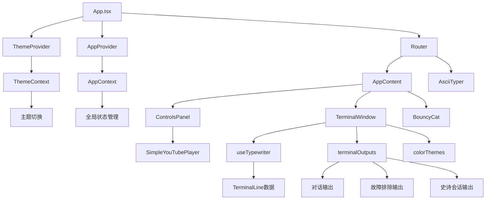
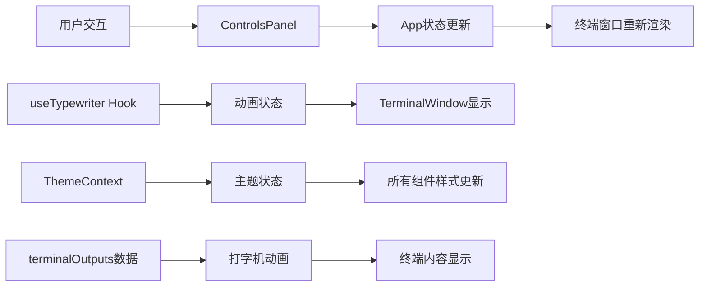

# I Vibe More Than You - 技术文档

## 项目概述

### 项目目的
"I Vibe More Than You" 是一个有趣的React Web应用，旨在创建一个视觉上令人印象深刻的多终端代码可视化工具。该应用模拟多个Mac风格的终端窗口，每个窗口都显示不同的开发场景，具有动画打字效果、可自定义主题和可变打字速度。

### 核心功能
- **多终端窗口管理**：支持1-10000个可拖拽和可调整大小的终端窗口
- **动画打字效果**：模拟真实的代码输入过程，支持不同的输出类型
- **主题系统**：6种内置主题（Dark、Light、Minimal、Retro Green、Dracula、Solarized Dark）
- **交互式控制**：实时调整终端数量、排列方式、动画速度
- **弹跳猫咪**：每5个终端生成一个弹跳的Nyan Cat动画
- **响应式设计**：适配不同屏幕尺寸
- **性能优化**：支持大量终端的高效渲染

### 技术栈
- **前端框架**：React 18.2.0 + TypeScript
- **构建工具**：Vite 5.2.0
- **样式框架**：Tailwind CSS 3.4.3
- **状态管理**：React Context API
- **UI交互**：react-draggable 4.4.6 + react-resizable 3.0.5
- **路由**：React Router DOM 7.6.2
- **测试框架**：Vitest 3.2.0 + Testing Library
- **代码质量**：ESLint + Prettier
- **部署平台**：Vercel

## 架构设计

### 系统架构图



### 主要组件说明

#### 1. App.tsx - 主应用组件
- **职责**：应用入口，管理终端窗口状态和布局
- **核心功能**：
  - 终端窗口的创建、删除和位置管理
  - 弹跳猫咪的生成和管理（每5个终端1只猫）
  - 窗口层级（z-index）管理
  - 性能优化（最多渲染80个终端窗口）

#### 2. TerminalWindow - 终端窗口组件
- **职责**：单个终端窗口的渲染和交互
- **核心功能**：
  - Mac风格的窗口外观（红黄绿交通灯按钮）
  - 拖拽和调整大小功能
  - 动画打字效果集成
  - 主题切换支持

#### 3. ControlsPanel - 控制面板组件
- **职责**：用户交互控制界面
- **核心功能**：
  - 终端数量控制（+1、-1、+10、-10按钮）
  - 主题切换下拉菜单
  - 终端排列功能
  - 猫咪管理
  - YouTube音乐播放器集成

#### 4. BouncyCat - 弹跳猫咪组件
- **职责**：屏幕上弹跳的Nyan Cat动画
- **核心功能**：
  - 物理弹跳动画（边界碰撞检测）
  - 性能优化（根据猫咪数量动态调整帧率）
  - 响应式窗口大小调整

### 数据流向



## 目录结构

```
MultiTerminalCodeViz/
├── public/                          # 静态资源
│   ├── favicon.ico                  # 网站图标
│   ├── nyancat.gif                  # 弹跳猫咪动画
│   ├── sonomaBackground.jpg         # 背景图片
│   └── vite.svg                     # Vite图标
├── src/                             # 源代码目录
│   ├── components/                  # React组件
│   │   ├── BouncyCat/              # 弹跳猫咪组件
│   │   │   └── BouncyCat.tsx
│   │   ├── ControlsPanel/          # 控制面板组件
│   │   │   └── ControlsPanel.tsx
│   │   ├── TerminalWindow/         # 终端窗口组件
│   │   │   ├── TerminalWindow.tsx
│   │   │   └── TerminalWindow.css
│   │   └── YouTubeAudioPlayer/     # YouTube播放器组件
│   │       └── SimpleYouTubePlayer.tsx
│   ├── contexts/                    # React Context
│   │   ├── AppContext.tsx          # 应用全局状态
│   │   ├── ThemeContext.tsx        # 主题管理
│   │   └── __tests__/              # Context测试文件
│   ├── data/                        # 数据配置
│   │   ├── colorThemes.ts          # 主题配色方案
│   │   └── terminalOutputs.ts      # 终端输出内容
│   ├── hooks/                       # 自定义Hooks
│   │   └── useTypewriter.ts        # 打字机效果Hook
│   ├── pages/                       # 页面组件
│   │   └── AsciiTyper.tsx          # ASCII艺术页面
│   ├── utils/                       # 工具函数
│   │   └── asciiArt.ts             # ASCII艺术生成
│   ├── App.tsx                      # 主应用组件
│   ├── App.css                      # 应用样式
│   ├── main.tsx                     # 应用入口
│   └── index.css                    # 全局样式
├── planning/                        # 项目规划文档
│   ├── plan.md                      # 开发计划
│   ├── spec.md                      # 项目规格说明
│   └── todo.md                      # 待办事项
├── package.json                     # 项目依赖配置
├── vite.config.ts                   # Vite构建配置
├── tailwind.config.js               # Tailwind CSS配置
├── tsconfig.json                    # TypeScript配置
├── eslint.config.js                 # ESLint配置
└── README.md                        # 项目说明
```

### 重要文件说明

- **src/data/terminalOutputs.ts**：包含6种不同类型的终端输出内容（对话、故障排除、史诗会话等）
- **src/data/colorThemes.ts**：定义了6种主题的完整配色方案
- **src/hooks/useTypewriter.ts**：实现打字机动画效果的核心逻辑
- **src/contexts/ThemeContext.tsx**：全局主题管理，支持实时切换
- **vite.config.ts**：配置了Vitest测试环境和构建选项

## 环境配置

### 开发环境要求

- **Node.js**：>= 18.0.0（推荐使用最新LTS版本）
- **npm**：>= 8.0.0 或 **yarn**：>= 1.22.0
- **Git**：用于版本控制
- **现代浏览器**：Chrome 90+、Firefox 88+、Safari 14+、Edge 90+

### 依赖安装步骤

1. **克隆项目**
```bash
git clone https://github.com/yolleygit/MultiTerminalCodeViz.git
cd MultiTerminalCodeViz
```

2. **安装依赖**
```bash
# 使用npm
npm install

# 或使用yarn
yarn install
```

3. **验证安装**
```bash
# 检查Node.js版本
node --version

# 检查npm版本
npm --version

# 验证依赖安装
npm list --depth=0
```

### 环境变量配置

项目目前不需要特殊的环境变量配置。所有配置都通过代码中的常量管理。

如需自定义配置，可以创建 `.env.local` 文件：

```bash
# .env.local (可选)
VITE_APP_TITLE="I Vibe More Than You"
VITE_MAX_TERMINALS=10000
VITE_DEFAULT_THEME=dark
```

## 快速开始

### 项目克隆和初始化

```bash
# 1. 克隆项目
git clone https://github.com/yolleygit/MultiTerminalCodeViz.git
cd MultiTerminalCodeViz

# 2. 安装依赖
npm install

# 3. 启动开发服务器
npm run dev
```

### 本地开发服务器启动

```bash
# 启动开发服务器（默认端口5173）
npm run dev

# 启动后访问
# http://localhost:5173
```

开发服务器启动后，您将看到：
```
  VITE v5.2.0  ready in 1234 ms

  ➜  Local:   http://localhost:5173/
  ➜  Network: use --host to expose
  ➜  press h + enter to show help
```

### 基本功能验证步骤

1. **验证终端窗口**
   - 页面加载后应显示1个终端窗口
   - 终端应开始显示动画打字效果
   - 窗口应可拖拽和调整大小

2. **验证控制面板**
   - 左上角应显示控制面板
   - 点击 `+` 按钮增加终端数量
   - 点击 `Arrange` 按钮整理终端布局

3. **验证主题切换**
   - 在控制面板中切换不同主题
   - 所有终端窗口应同时更新颜色

4. **验证弹跳猫咪**
   - 当终端数量达到5个时，应出现弹跳的猫咪
   - 猫咪应在屏幕边界内弹跳

5. **验证路由功能**
   - 访问 `http://localhost:5173/typer` 查看ASCII艺术页面

## API文档

### 主要组件API

#### TerminalWindow组件

```typescript
interface TerminalWindowProps {
  id: string;                    // 终端唯一标识
  initialPosition?: { x: number; y: number }; // 初始位置
  initialSize?: { width?: number; height?: number }; // 初始大小
  title?: string;                // 窗口标题
  onClose?: () => void;          // 关闭回调
  onPositionChange?: (id: string, position: { x: number; y: number }) => void;
  zIndex?: number;               // 层级
  onFocus?: (id: string) => void; // 聚焦回调
  totalTerminalCount?: number;    // 总终端数量
}
```

#### ControlsPanel组件

```typescript
interface ControlsPanelProps {
  terminalCount: number;         // 当前终端数量
  onTerminalCountChange: (count: number) => void; // 数量变更回调
  onArrangeTerminals?: () => void; // 排列回调
  minTerminals?: number;         // 最小终端数（默认1）
  maxTerminals?: number;         // 最大终端数（默认10000）
  catCount?: number;             // 猫咪数量
  onRemoveAllCats?: () => void;  // 移除所有猫咪回调
}
```

#### useTypewriter Hook

```typescript
interface UseTypewriterProps {
  lines: TerminalLine[];         // 要显示的行数据
  speed?: number;                // 打字速度（毫秒/token）
  enabled?: boolean;             // 是否启用动画
  loop?: boolean;                // 是否循环播放
  loopDelay?: number;            // 循环延迟时间
}

// 返回值
interface UseTypewriterReturn {
  displayedLines: TerminalLine[]; // 当前显示的行
  isTyping: boolean;             // 是否正在打字
}
```

### 数据结构

#### TerminalLine接口

```typescript
interface TerminalLine {
  text: string;                  // 显示文本
  color?: string;                // 颜色（已废弃，使用colorRole）
  colorRole?: TerminalColorRole; // 语义化颜色角色
  bold?: boolean;                // 是否粗体
  delay?: number;                // 显示前延迟
}
```

#### 主题系统

```typescript
type TerminalColorRole = 
  | 'muted'      // 灰色，次要文本
  | 'success'    // 绿色，成功消息
  | 'warning'    // 黄色，警告信息
  | 'error'      // 红色，错误信息
  | 'info'       // 蓝色，信息提示
  | 'accent'     // 紫色/青色，高亮
  | 'primary'    // 主要文本颜色
  | 'secondary'  // 次要文本颜色
  | 'command';   // 命令/输入文本

interface TerminalTheme {
  name: string;                  // 主题名称
  background: string;            // 背景色类名
  colors: Record<TerminalColorRole, string>; // 颜色映射
}
```

## 开发指南

### 代码规范和最佳实践

#### 1. TypeScript规范
- 所有组件必须使用TypeScript编写
- 为所有props定义接口
- 使用严格的类型检查
- 避免使用 `any` 类型

```typescript
// ✅ 好的实践
interface ComponentProps {
  title: string;
  count: number;
  onUpdate: (value: number) => void;
}

// ❌ 避免
const props: any = { ... };
```

#### 2. React组件规范
- 使用函数组件和Hooks
- 组件名使用PascalCase
- 文件名与组件名保持一致
- 使用JSDoc注释文档化组件

```typescript
/**
 * 终端窗口组件
 * @param props - 组件属性
 * @returns JSX元素
 */
export function TerminalWindow(props: TerminalWindowProps) {
  // 组件实现
}
```

#### 3. 样式规范
- 优先使用Tailwind CSS类名
- 避免内联样式，除非必要
- 使用语义化的类名组合
- 响应式设计优先

```typescript
// ✅ 推荐
<div className="bg-gray-800 border border-gray-600 rounded-lg shadow-lg">

// ❌ 避免
<div style={{ backgroundColor: '#1f2937', border: '1px solid #4b5563' }}>
```

#### 4. 状态管理规范
- 使用React Context进行全局状态管理
- 本地状态优先使用useState
- 复杂状态逻辑使用useReducer
- 避免不必要的状态提升

### 测试运行方法

#### 1. 单元测试
```bash
# 运行所有测试
npm run test

# 运行测试并显示覆盖率
npm run test -- --coverage

# 监听模式运行测试
npm run test -- --watch

# 运行特定测试文件
npm run test -- App.test.tsx
```

#### 2. 测试UI界面
```bash
# 启动Vitest UI界面
npm run test:ui
```

访问 `http://localhost:51204/__vitest__/` 查看测试结果。

#### 3. 编写测试示例

```typescript
// src/components/__tests__/TerminalWindow.test.tsx
import { render, screen } from '@testing-library/react';
import { TerminalWindow } from '../TerminalWindow/TerminalWindow';
import { ThemeProvider } from '../../contexts/ThemeContext';

describe('TerminalWindow', () => {
  it('应该渲染终端窗口', () => {
    render(
      <ThemeProvider>
        <TerminalWindow id="test-1" title="Test Terminal" />
      </ThemeProvider>
    );

    expect(screen.getByText('Test Terminal')).toBeInTheDocument();
  });
});
```

### 构建和部署流程

#### 1. 本地构建
```bash
# 构建生产版本
npm run build

# 预览构建结果
npm run preview
```

构建产物将生成在 `dist/` 目录中。

#### 2. 代码质量检查
```bash
# ESLint检查
npm run lint

# 代码格式化
npm run format

# TypeScript类型检查
npx tsc --noEmit
```

#### 3. Vercel部署

项目已配置自动部署到Vercel：

```json
// vercel.json
{
  "buildCommand": "npm run vercel-build",
  "outputDirectory": "dist",
  "framework": "vite"
}
```

**部署步骤：**
1. 推送代码到GitHub主分支
2. Vercel自动检测变更并开始构建
3. 构建完成后自动部署到生产环境

**手动部署：**
```bash
# 安装Vercel CLI
npm i -g vercel

# 登录Vercel
vercel login

# 部署
vercel --prod
```

#### 4. 性能优化建议

- **代码分割**：使用React.lazy()进行组件懒加载
- **图片优化**：压缩静态资源，使用WebP格式
- **Bundle分析**：使用 `npm run build -- --analyze` 分析包大小
- **缓存策略**：配置适当的HTTP缓存头

### 开发工作流

#### 1. 功能开发流程
```bash
# 1. 创建功能分支
git checkout -b feature/new-feature

# 2. 开发功能
npm run dev

# 3. 运行测试
npm run test

# 4. 代码检查
npm run lint

# 5. 提交代码
git add .
git commit -m "feat: 添加新功能"

# 6. 推送分支
git push origin feature/new-feature
```

#### 2. 代码审查清单
- [ ] TypeScript类型定义完整
- [ ] 组件props接口清晰
- [ ] 测试覆盖核心功能
- [ ] ESLint检查通过
- [ ] 性能影响评估
- [ ] 响应式设计验证

## 常见问题

### 安装和启动问题

#### Q1: npm install失败
**问题**：依赖安装过程中出现错误

**解决方案**：
```bash
# 清理npm缓存
npm cache clean --force

# 删除node_modules和package-lock.json
rm -rf node_modules package-lock.json

# 重新安装
npm install

# 如果仍有问题，尝试使用yarn
yarn install
```

#### Q2: 开发服务器启动失败
**问题**：`npm run dev` 命令执行失败

**解决方案**：
```bash
# 检查端口是否被占用
lsof -i :5173

# 使用不同端口启动
npm run dev -- --port 3000

# 检查Node.js版本
node --version  # 应该 >= 18.0.0
```

#### Q3: TypeScript编译错误
**问题**：类型检查失败

**解决方案**：
```bash
# 检查TypeScript配置
npx tsc --showConfig

# 重新生成类型声明
rm -rf node_modules/@types
npm install

# 检查具体错误
npx tsc --noEmit
```

### 功能使用问题

#### Q4: 终端窗口不显示动画
**问题**：终端窗口静态显示，没有打字动画

**可能原因**：
- useTypewriter Hook未正确初始化
- terminalOutputs数据为空
- 动画被禁用

**解决方案**：
```typescript
// 检查useTypewriter配置
const { displayedLines, isTyping } = useTypewriter({
  lines: terminalOutputs[outputType] || [],
  speed: terminalSpeed,
  enabled: true,  // 确保启用动画
  loop: true,     // 确保循环播放
  loopDelay: 3000
});
```

#### Q5: 主题切换不生效
**问题**：切换主题后颜色没有变化

**解决方案**：
```typescript
// 确保组件被ThemeProvider包裹
<ThemeProvider>
  <YourComponent />
</ThemeProvider>

// 在组件中正确使用主题
const { getColorForRole } = useTheme();
const textColor = getColorForRole('primary');
```

#### Q6: 拖拽功能异常
**问题**：终端窗口无法拖拽或拖拽后位置错误

**解决方案**：
```typescript
// 检查Draggable配置
<Draggable
  nodeRef={nodeRef}  // 确保使用ref
  bounds="parent"    // 设置边界
  onDrag={(e, data) => {
    // 处理拖拽事件
    onPositionChange?.(id, { x: data.x, y: data.y });
  }}
>
```

### 性能问题

#### Q7: 大量终端时性能下降
**问题**：创建100+终端时应用卡顿

**解决方案**：
- 应用已内置性能优化，最多渲染80个终端
- 减少同时显示的终端数量
- 关闭不必要的动画效果

```typescript
// 性能优化配置
const maxRenderedTerminals = actualTerminalCount > 1000 ? 40 : 80;
```

#### Q8: 弹跳猫咪影响性能
**问题**：大量猫咪导致动画卡顿

**解决方案**：
```typescript
// 动态调整帧率
const throttleTime = totalCatCount > 50 ? 50 : totalCatCount > 20 ? 33 : 16;
```

或者点击"Remove Cats"按钮移除所有猫咪。

### 构建和部署问题

#### Q9: 构建失败
**问题**：`npm run build` 执行失败

**解决方案**：
```bash
# 检查TypeScript错误
npx tsc --noEmit

# 检查ESLint错误
npm run lint

# 清理并重新构建
rm -rf dist
npm run build
```

#### Q10: Vercel部署失败
**问题**：自动部署过程中出现错误

**解决方案**：
1. 检查vercel.json配置
2. 确保所有依赖都在package.json中
3. 检查构建日志中的具体错误信息
4. 验证环境变量配置

```bash
# 本地测试Vercel构建
npm run vercel-build
```

### 开发环境问题

#### Q11: 热重载不工作
**问题**：修改代码后页面不自动刷新

**解决方案**：
```bash
# 重启开发服务器
npm run dev

# 检查文件监听
# 在vite.config.ts中添加：
export default defineConfig({
  server: {
    watch: {
      usePolling: true
    }
  }
});
```

#### Q12: 样式不生效
**问题**：Tailwind CSS类名不起作用

**解决方案**：
```bash
# 检查Tailwind配置
npx tailwindcss -i ./src/index.css -o ./dist/output.css --watch

# 确保tailwind.config.js包含所有文件
content: [
  "./index.html",
  "./src/**/*.{js,ts,jsx,tsx}",
]
```

## 贡献指南

### 提交代码
1. Fork项目到个人仓库
2. 创建功能分支：`git checkout -b feature/amazing-feature`
3. 提交更改：`git commit -m 'Add some amazing feature'`
4. 推送分支：`git push origin feature/amazing-feature`
5. 创建Pull Request

### 报告问题
请在GitHub Issues中报告问题，包含：
- 问题描述
- 复现步骤
- 期望行为
- 实际行为
- 环境信息（浏览器、Node.js版本等）

---

**项目地址**：https://github.com/yolleygit/MultiTerminalCodeViz
**在线演示**：https://www.IVibeMoreThanYou.com/
**技术支持**：通过GitHub Issues提交问题
```
